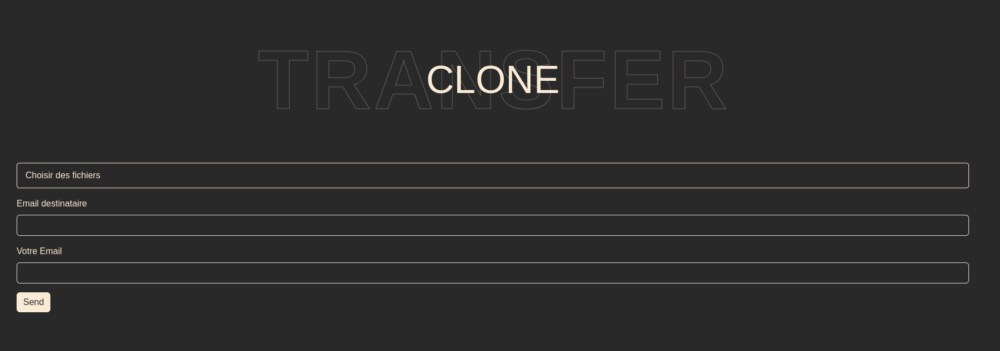

<style>
  .wrap_tag {
    display: flex; 
    gap: 0.3em;
    padding: 0.3em; 
  }
  .tag {
    color: #faebd7; 
    border: 1px solid antiquewhite; 
    background-color: #292929; 
    padding: 0.3em; 
    width: min-content; 
    border-radius: 7px;
  }
</style>

# Clone Transfert!

Clone Transfert est une application de transfert de fichiers en ligne, conçue pour faciliter l'envoi de gros fichiers jusqu'à 2 Go gratuitement. Elle permet le partage de documents, de photos, de vidéos et d'autres types de fichiers via une simple interface web. L'utilisateur télécharge ses fichiers, entre l'adresse e-mail du destinataire, et Clone Transfert envoie un lien de téléchargement. Les fichiers sont disponibles pour une durée limitée (généralement sept jours). L'application est appréciée pour sa simplicité d'utilisation et sa fiabilité.

Cette application est développée par des étudiants en fin formation de développeur web, mettant à contribution leurs compétences tout en répondant à un besoin pratique et contemporain de partage de fichiers en ligne.

Ce projet a pour vocation de nous présenter et d'appréhender le côté conception et de nous orienter vers le niveau ou une formation Concepteur Développeur d'Applications WEB (CDA).

<div class="wrap_tag">
  <div class="tag">PHP</div>
  <div class="tag">HTML</div>
  <div class="tag">JavaScript</div>
  <div class="tag">JSON</div>
  <div class="tag">CSS</div>
  <div class="tag">...</div>
</div>
<div class="wrap_tag">
  <div class="tag">GIT</div>
  <div class="tag">Composer</div>
  <div class="tag">Kanban</div>
  <div class="tag">Apache</div>
  <div class="tag">Windows</div>
  <div class="tag">Linux</div>
  <div class="tag">...</div>
</div>
<div class="wrap_tag">
  <div class="tag">SEO</div>
  <div class="tag">Design</div>
  <div class="tag">...</div>
</div>


---



## Guide Utilisateur Final :

1. Cliquez sur le bouton "Choisir des fichiers" et sélectionnez les fichiers à envoyer.
2. Saisissez l'adresse e-mail du destinataire.
3. Saisissez votre adresse e-mail.
4. Cliquez sur "Transférer" pour envoyer les fichiers. Vous recevrez un e-mail de confirmation.
5. Le destinataire recevra un lien de téléchargement valable 7 jours.

## Guide Développeur : 

vous avez bessoin d'un fichier DotEnv (.env)

```shell
DB_CONNECTION=sqlite
DB_DATABASE=bdd.db

MAIL_HOST=XXXXXXXXXXXXXXX
MAIL_USERNAME=XXXXXXXXXXXXXXX
MAIL_PASSWORD=XXXXXXXXXXXXXXX
MAIL_PORT=465
MAIL_FROM=XXXXXXXXXXXXXXX
MAIL_FROM_NAME=CloneTranfert

WEB_URL=http://localhost
```

> Windows : [install](./documents/windows/install.md)

> Linux / Mac : [install](./documents/linux/install.md)
